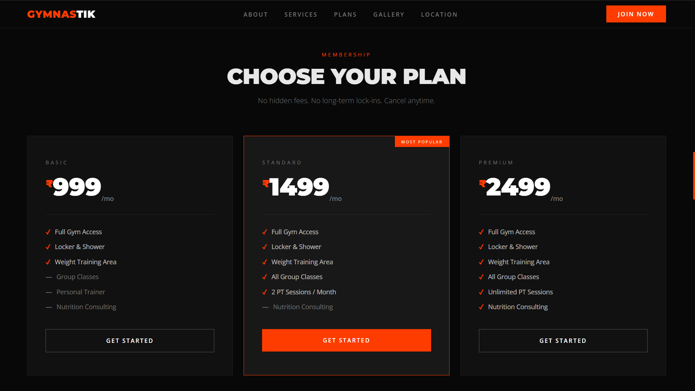
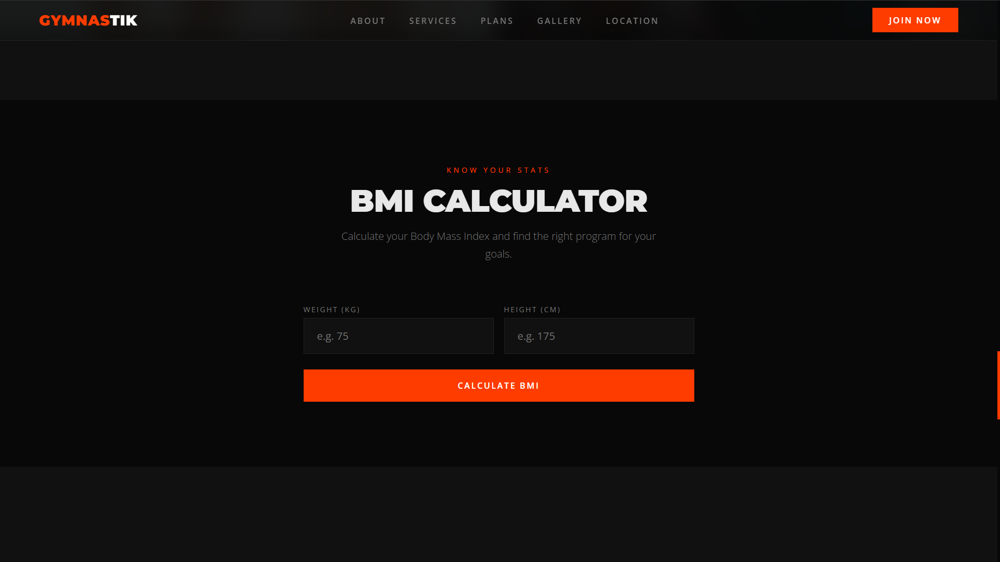

# 🏋️ Gym Website

A modern and responsive **Gym Website** designed for fitness centers, gyms, and personal trainers to showcase their services, facilities, and membership plans.

This project demonstrates a clean UI, responsive layout and user-friendly design suitable for real-world gym businesses.

---

## 🌐 Live Demo

https://priyanshung1480.github.io/Gym-Website/

---

## 📸 Website Preview

(Add screenshots here)

---

## ✨ Features

- Modern hero section
- Membership plans section
- Gym gallery
- BMI calculator
- WhatsApp reservation system
- Responsive design for all devices
- Smooth navigation
- Clean dark UI design

---

## 🛠 Technologies Used

- HTML5  
- CSS3  
- Bootstrap  
- JavaScript  

---

## 📱 Website Sections

- Hero Section
- About Gym
- Membership Plans
- Gym Gallery
- BMI Calculator
- Reservation / Contact Section
- Footer

---

## 📂 Project Structure
index.html images/ README.md 

## Author 
Priyanshu Negi Frontend Web Developer
